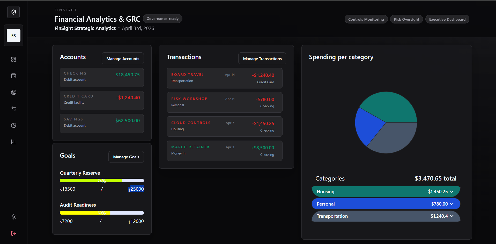
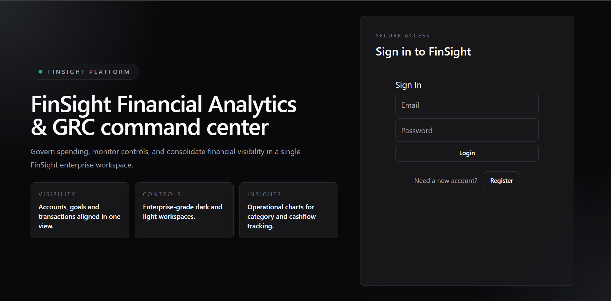
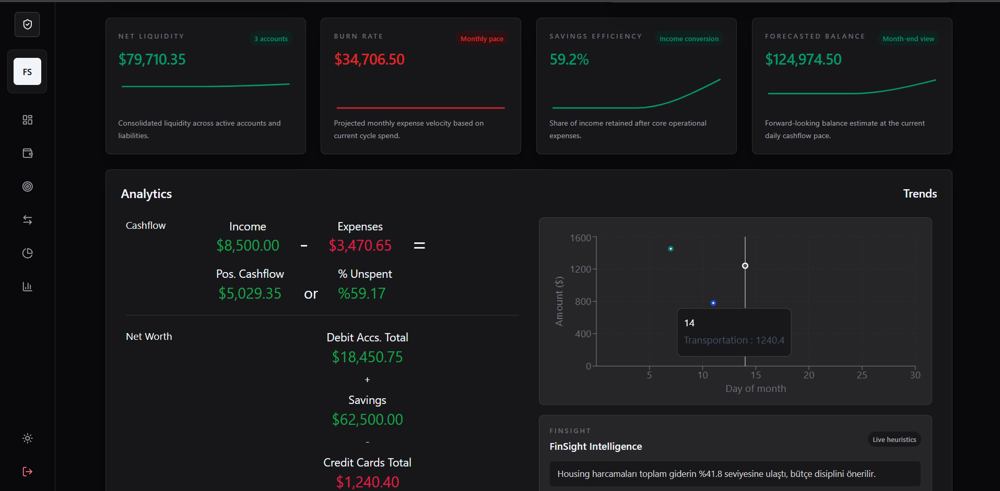

# FinSight 📊

FinSight is a web-based financial analytics and control dashboard built for tracking accounts, transactions, spending categories, savings goals, and high-level operational KPIs in a single workspace.

It combines a simple personal-finance data model with an enterprise-style interface. The result is a product that can be positioned both as a budgeting dashboard and as a lightweight Financial Analytics & GRC command center.

## 📱 Interface Preview

<p align="center">
  
<br/>
</p>

<p align="center">
  
  
<br/>
</p>

## What This Project Does

FinSight helps a signed-in user:

- store and manage financial accounts
- create income and expense transactions
- monitor goal progress
- review category-based spending
- observe cashflow and net worth trends
- view summary KPI cards such as liquidity, burn rate, savings efficiency, and forecasted balance

In short, this project turns raw financial activity into an interactive dashboard with operational visibility.

## Core Features

- Secure authentication with Firebase Auth
- Realtime user-specific data storage with Firebase Realtime Database
- Dashboard KPI cards generated from live account and transaction data
- Account management for debit and credit-style balances
- Goal tracking with progress visualization
- Transaction creation, editing, deletion, and account balance reflection
- Spending breakdown by category
- Analytics section for cashflow, net worth, and insight messaging
- Budget vs actual governance panel with variance tracking
- Role-aware workspace controls for admin, analyst, and viewer modes
- Audit log timeline for traceable create, update, delete, and access events
- Optional FastAPI analytics API for server-side summary computation
- Dark and light theme support
- Responsive layout for desktop and mobile usage

## Technical Overview

The application is a React single-page app created with `react-scripts`.

### Frontend

- `React` drives the component structure and stateful UI
- `MUI` is used for buttons, inputs, dialogs, and baseline theming
- `Tailwind CSS` utility classes are used for layout, spacing, and visual styling
- `Recharts` powers KPI sparklines and analytics visualizations

### Backend Services

- `Firebase Authentication` handles login and registration
- `Firebase Realtime Database` stores user-scoped data under each authenticated user's UID
- Optional `FastAPI` service can compute executive summaries server-side when `REACT_APP_ANALYTICS_API_URL` is configured

### Data Model

Each signed-in user has a database branch that contains:

- `userData`
- `accounts`
- `transactions`
- `goals`

The dashboard reads that branch once authenticated and derives summaries such as:

- total income
- total expenses
- net liquidity
- savings efficiency
- month-end forecast
- budget adherence
- liquidity runway
- goals at risk

## Project Structure

Key application areas:

- `src/components/Login/`  
  Authentication screens and account creation flow

- `src/components/Accounts/`  
  Account list, modal, and account CRUD flow

- `src/components/Transactions/`  
  Transaction list, modal, form logic, and balance reflection

- `src/components/Goals/`  
  Goal tracking and progress management

- `src/components/Spending/`  
  Category analysis and accordion/chart display

- `src/components/Analytics/`  
  Cashflow, net worth, trends, and insight summaries

- `src/config/Firebase.js`  
  Firebase app initialization and auth setup

- `src/utils/financialSummary.js`  
  Shared KPI, budget variance, and governance summary calculations

- `backend/app/main.py`  
  Optional FastAPI analytics endpoint for server-side summary generation

## How It Works

1. A user signs in or creates an account.
2. Firebase Auth provides the active session.
3. The dashboard subscribes to the user's database path.
4. Accounts, goals, and transactions are loaded into the UI.
5. Derived analytics are calculated in the client and rendered as cards, lists, and charts.

This means the dashboard is not only a CRUD app. It also performs client-side interpretation of financial data to produce meaningful KPI outputs.

## Installation

```bash
npm install --ignore-scripts
```

`--ignore-scripts` may be useful in environments where `node-sass` fails to build.

## Run Locally

```bash
npm start
```

The app will typically be available at:

`http://localhost:3000`

## Production Build

```bash
npm run build
```

## Environment

Create a `.env.local` at the project root (not committed) using the template:

```
REACT_APP_FIREBASE_API_KEY=...
REACT_APP_FIREBASE_AUTH_DOMAIN=...
REACT_APP_FIREBASE_PROJECT_ID=...
REACT_APP_FIREBASE_STORAGE_BUCKET=...
REACT_APP_FIREBASE_MESSAGING_SENDER_ID=...
REACT_APP_FIREBASE_APP_ID=...
REACT_APP_FIREBASE_MEASUREMENT_ID=...
```

Your variables must start with `REACT_APP_` for Create React App to inject them at build time.

## Test Stack

- `Cypress` end-to-end tests
- `Testing Library` packages for React testing support

## Current Tech Stack

- React 18
- JavaScript
- Tailwind CSS
- Material UI
- Firebase Auth
- Firebase Realtime Database
- Recharts
- Cypress

## Brand Positioning

FinSight is currently styled as:

`Financial Analytics & GRC`

That positioning gives the app a more professional and executive-facing identity compared to a standard personal finance tracker.

## Notes

- The project currently uses Firebase directly from the frontend.
- User data is scoped by authenticated UID.
- Analytics are calculated client-side from stored transactional data.
- Governance bootstrap provisions default roles and category budgets for new workspaces.
- Audit events are written for account, goal, transaction, budget, and access changes.
- A live Firebase project configuration is present in the app configuration.

## Author

Emre Ördek

## Screenshots
